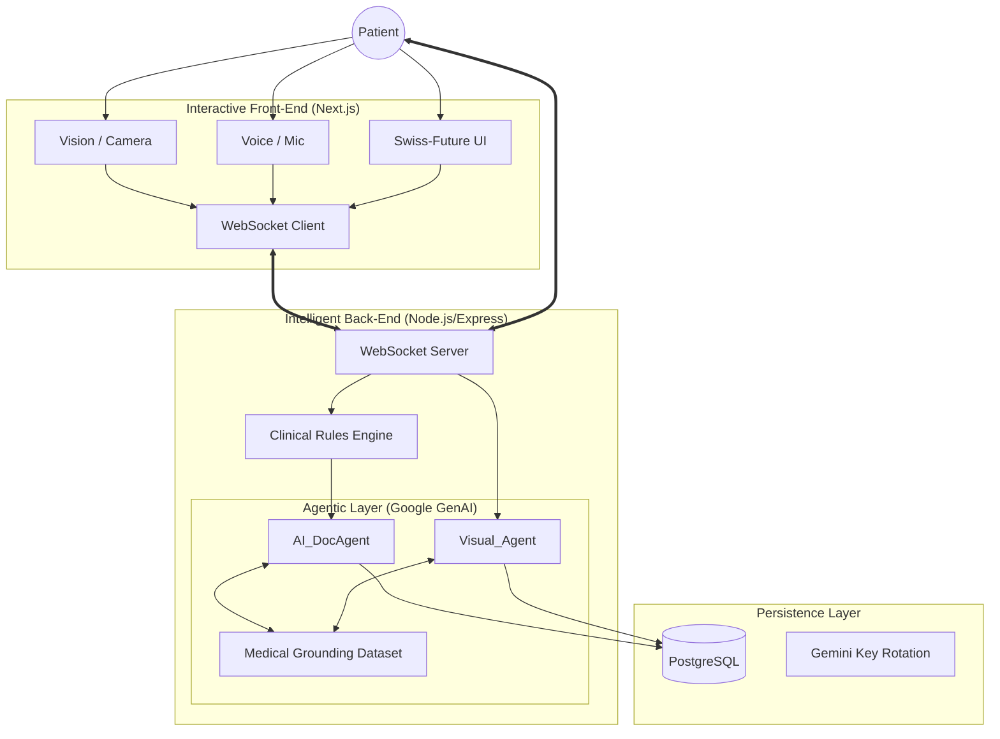
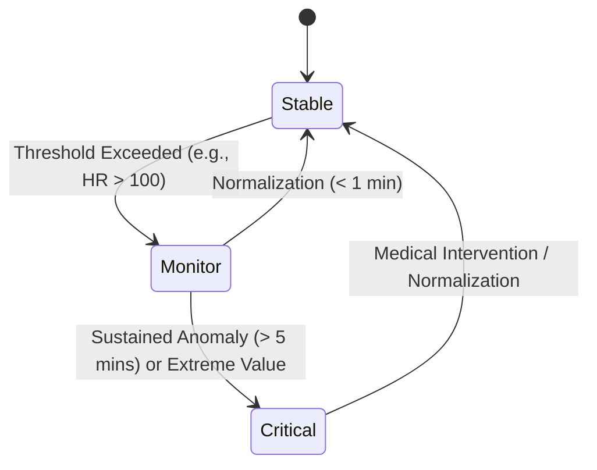
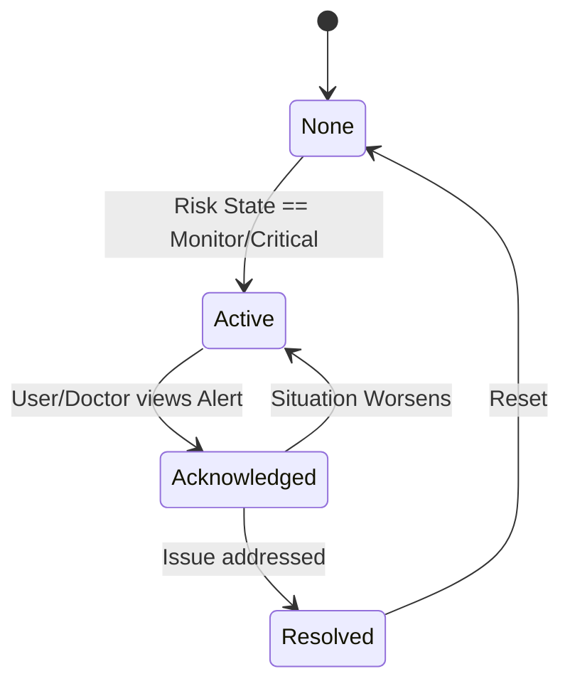
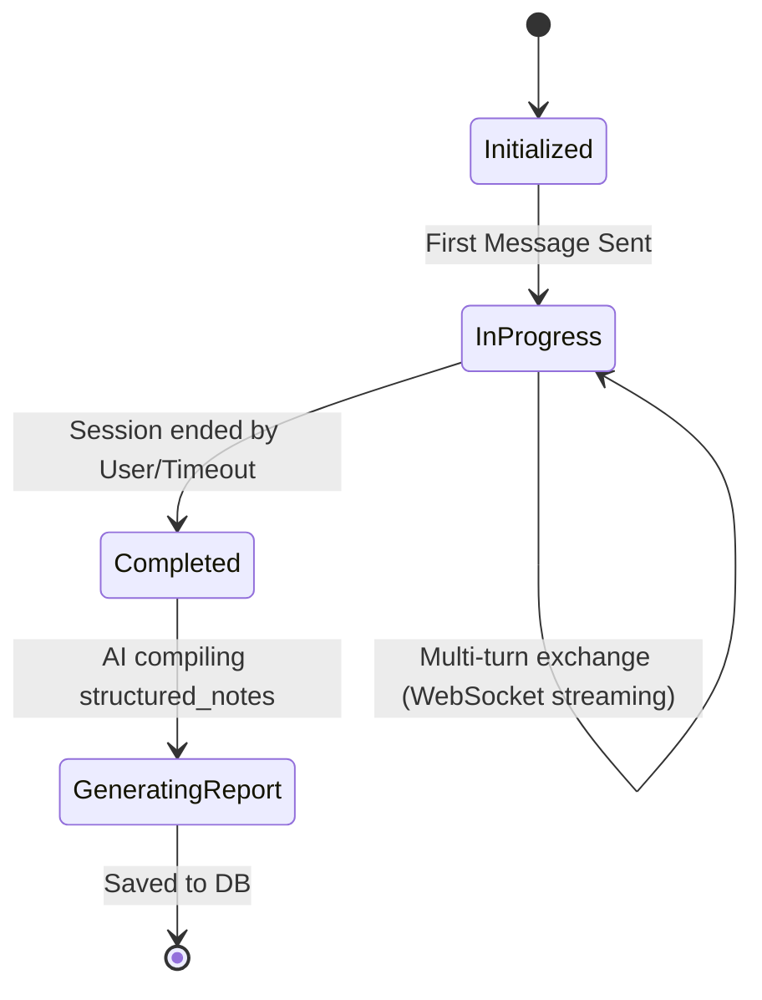

# MyHealth AI — Personal Mini-Hospital Architecture

## 0. Multimodal Life Loop (Gemini Live Agent Flow)



## 1. Full Architecture System Diagram Description

The MyHealth AI platform is designed as a real-time, highly scalable, and modular AI-driven healthcare system. 

### Core Layers:
1. **Client Interface Layer (Frontend):**
   - Web / Mobile application built in React/Next.js.
   - Maintains an ongoing WebSocket connection to the backend for real-time vital streaming and instantaneous AI responses.
2. **API & Routing Layer:**
   - **HTTP REST APIs:** Serves historical data (Reports, Profile CRUD operations).
   - **WebSocket Gateway:** Handles high-throughput streaming of `VitalRecord` telemetry. Uses Redis Pub/Sub if scaled horizontally across multiple instances.
3. **Core Services Layer:**
   - **Vital & Telemetry Engine:** Processes incoming WebSockets, buffers high-frequency vitals, and periodically flushes them to a Time-Series Database.
   - **Clinical Rules Engine:** A reactive layer that watches incoming vitals against baseline thresholds to trigger Risk State changes.
   - **Conversation Service:** Manages conversational state, invokes the AI Doc Agent, tracks prompt context length, and chunks memory.
4. **AI & Agentic Layer:**
   - **AI_DocAgent:** A stateful LLM orchestrator. Maintains dialogue memory, triggers classification, and emits `structured_notes`.
   - **RAG / Medical Knowledge Base:** Grounds the AI in clinical safety guidelines and user historical reports.
5. **Data Layer (Polyglot Persistence):**
   - **Relational DB (PostgreSQL):** Stores `UserProfile`, `HealthReport`, `Conversation`.
   - **Time-Series DB (TimescaleDB / InfluxDB):** Optimized for high-frequency `VitalRecord` insertion and aggregation.
   - **Cache & Pub/Sub (Redis):** Handles WebSocket sessions, active agent states, and conversation memory buffering.

---

## 2. Entity Schemas 

### Data Models (Prisma/SQL Inspired)

```prisma
model UserProfile {
  id         String   @id @default(uuid())
  name       String
  age        Int
  gender     String
  weight     Float    // kg
  height     Float    // cm
  created_at DateTime @default(now())
  updated_at DateTime @updatedAt
  
  vitals         VitalRecord[]
  reports        HealthReport[]
  conversations  Conversation[]
}

model VitalRecord {
  id               String   @id @default(uuid())
  user_id          String
  timestamp        DateTime @default(now())
  
  heart_rate       Int      // bpm
  blood_pressure   String   // e.g., "120/80" -> Or parsed into systolic/diastolic Ints
  temperature      Float    // Celsius
  spo2             Float    // Percentage
  respiratory_rate Int      // breaths per min
  
  user             UserProfile @relation(fields: [user_id], references: [id])
  
  @@index([user_id, timestamp(sort: Desc)])
}

model HealthReport {
  id             String   @id @default(uuid())
  user_id        String
  timestamp      DateTime @default(now())
  risk_score     Float    // 0.0 to 100.0
  classification String   // "Healthy", "At Risk", "Critical"
  suggestions    Json     // Array of actionable AI-generated advice
  
  user           UserProfile @relation(fields: [user_id], references: [id])
}

model AI_DocAgentSession {
  id            String   @id @default(uuid())
  user_id       String
  session_start DateTime @default(now())
  session_end   DateTime?
  memory        Json     // Stores rolling buffer of chat history / context vectors
}

model Conversation {
  id               String   @id @default(uuid())
  user_id          String
  ai_doctor_id     String   // Identifies the specific AI Persona/Agent
  timestamp        DateTime @default(now())
  
  transcript       Json     // Array of { sender, message, timestamp }
  structured_notes String   // AI-generated SOAP (Subjective, Objective, Assessment, Plan) note
  confidence_score Float    // AI confidence in its assessment
  
  user             UserProfile @relation(fields: [user_id], references: [id])
}
```

---

## 3. State Machine Flows

These state machines define how the system transitions based on telemetry and user interactions.

### A. Risk State Machine (Vital Monitoring)
Governed by the Clinical Rules Engine.



### B. Alert State Machine (User / System Notifications)
Triggered when Risk State elevates.



### C. Conversation State Machine (AI Session)
Lifecyle of a user's consultation with the AI.



---

## 4. Modular Code Plan

The folder structure strictly separates concerns. Services handle business logic, Engines handle continuous reactive processing, and Agents encapsulate LLM workflows.

```text
/backend
  /agents               # LLM integration and Persona management
    ├── triage_agent.ts           # Rapid assessment based on vitals
    ├── doctor_agent.ts           # Deep consultative logic & structured charting
    └── memory_manager.ts         # Handles context window and rolling buffers
  /services             # Core Business Logic (CRUD & Orchestration)
    ├── user_service.ts           # Profile management
    ├── vital_service.ts          # Read/Write DB interfaces for vitals
    ├── report_service.ts         # Generates and retrieves HealthReports
    └── conversation_service.ts   # Manages session state and transcripts
  /engines              # Background / Continuous processing loops
    ├── rules_engine.ts           # Evaluates vital streams against Risk State triggers
    └── alert_engine.ts           # Dispatches notifications and manages Alert State
  /routes               # HTTP endpoints
    ├── v1/users.ts
    ├── v1/reports.ts
    └── websockets/stream.ts      # Real-time WebSocket handlers for Vitals & Chat
  /middleware           # Request validation, Auth, Rate Limiting
    ├── auth_guard.ts
    ├── rate_limiter.ts           # Prevents API abuse
    └── ws_authenticator.ts       # Secure WebSocket handshakes
  /utils                # Shared helpers
    ├── logger.ts                 # Sanitized logging (no PII/PHI)
    └── validation.ts             # Zod/Joi schemas for incoming data

/frontend
  /pages
    ├── dashboard.tsx             # Main view showing real-time charts
    ├── consult.tsx               # Chat interface for the AI Doctor
    └── reports.tsx               # Historical health summaries
  /components
    ├── VitalCard.tsx             # Reusable UI for displaying Heart Rate, SpO2
    ├── ChatBubble.tsx            # Animated streaming text bubble
    └── AlertBanner.tsx           # Global warning for Critical states
  /charts
    ├── EkgChart.tsx              # Real-time D3/Chart.js waveform for vitals
    └── TrendGraph.tsx            # Long-term historical data
  /styles
    ├── globals.css
    └── themes.css                # Medical-grade UI (calm blues, alert reds)
```

### Addressing Non-Functional Requirements:
1. **Response latency < 2 seconds:** Handled by moving the LLM conversation over WebSockets (streaming chunks) and caching Context Memory in Redis.
2. **WebSocket streaming:** Native Node.js `ws` or `Socket.io` attached to `/routes/websockets/stream.ts`.
3. **Scalability:** Stateless API containers. Vitals stream through Redis Pub/Sub, separating ingestion from database writes (batch processing to TimescaleDB).
4. **Logging:** Centralized `utils/logger.ts` uses structured JSON logs formatted for stdout/ELK while expressly stripping `name`, `transcript`, and `structured_notes` to protect PII.
5. **Modular Code Structure:** Clearly segmented into `agents`, `services`, and `engines` allowing separate teams/functions to scale independently.

---

## 5. Project Story

### Inspiration
The healthcare industry is often divided between cold, precise IoT data and warm, empathetic human consultation. We asked ourselves: *Can an AI bridge this gap?* We were inspired to create **MyHealthAI**—a personal "Mini-Hospital" that doesn't just read your numbers, but understands your context. We wanted to move past the traditional "text box" paradigm and create a **Multimodal Life Loop** where an agent can **See** your symptoms, **Hear** your concerns, and **Speak** with clinical authority.

### Technical Challenges
- **Real-time Multimodal Sync:** Synchronizing real-time vital telemetry with asynchronous AI vision analysis was a major engineering hurdle. We solved this by creating a unified **Stateful Agent Session** that caches context in real-time.
- **Medical Safety & Grounding:** Balancing empathy with clinical strictness. We implemented a **Clinical Grounding Layer** that injects verified AHA, ADA, and GINA medical guidelines into the agent's context, making it "hallucination-proof" for medical safety.

### Learnings
1. **Gemini 2.0 Flash is the Meta:** Its ability to process vision and text simultaneously with sub-2-second latency is what makes "Live" agents feel real.
2. **Grounding is Non-Negotiable:** In medical AI, the model's ability to stick to provided guidelines is more valuable than its creative reasoning.
3. **Deterministic Logic for Safety:** Decoupled risk scoring (using math, not LLMs) is the safest way to handle biometric data.
