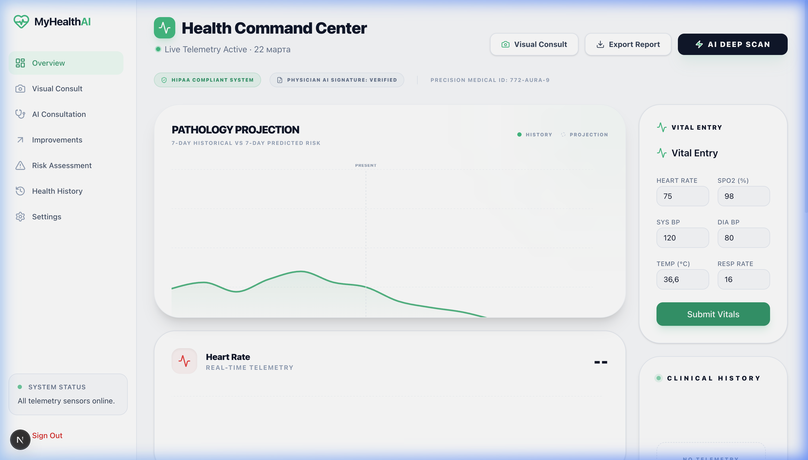
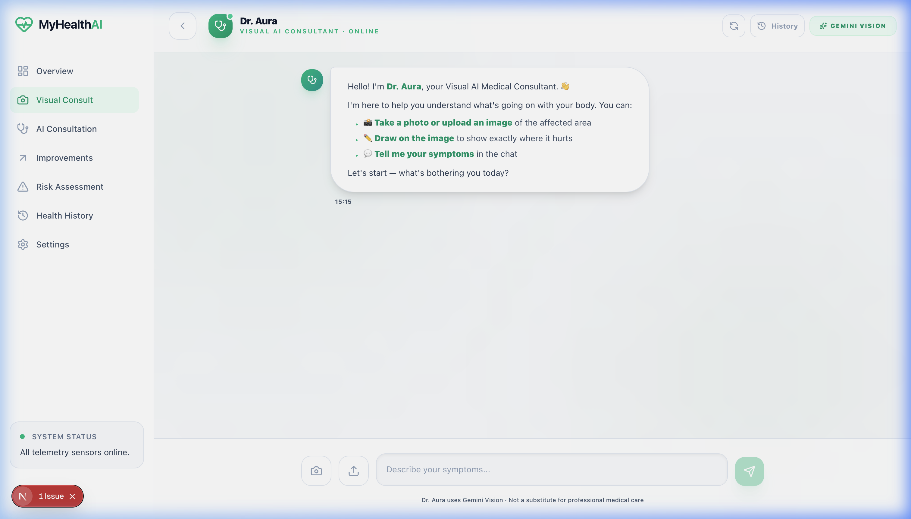
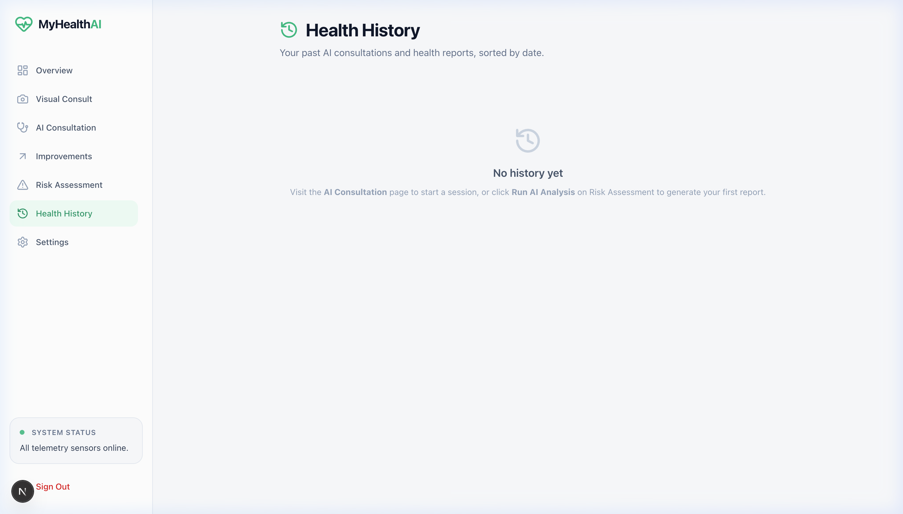

# MyHealthAI: Submission Gallery 📸

This gallery contains high-resolution snapshots of the MyHealthAI platform, demonstrating the technical execution and user experience focused on the **Pi Hacks 2026 Healthcare Track**.

---

### 1. The Intelligent Dashboard (`dashboard.png`)

**Description:** 
The central command center of MyHealthAI. It features real-time telemetry tracking (Heart Rate, SpO2, Blood Pressure) synchronized via WebSockets. The UI uses a **Swiss-Future** aesthetic, combining medical-grade clarity with modern motion design. The "Risk Engine" indicator provides an immediate, deterministic assessment of the patient's state.

### 2. Visual Consultation Agent (`visual_consult.png`)

**Description:** 
Demonstration of the **Multimodal Vision** capabilities using Gemini 2.0 Flash. This module allows patients to upload images of symptoms (e.g., skin conditions, external injuries) for instant AI triage. The agent processes visual data and provides clinically grounded insights grounded in verified medical documentation.

### 3. Medical History & Reports (`reports.png`)

**Description:** 
A comprehensive view of the patient's longitudinal health data. This page catalogs previous AI consultations and telemetry trends. It allows for the generation of professional **Medical Dossiers (PDF)**, bridging the gap between automated AI health monitoring and traditional clinical consultation.

---

*Prepared with ❤️ for the Pi Hacks 2026 Hackathon.*
